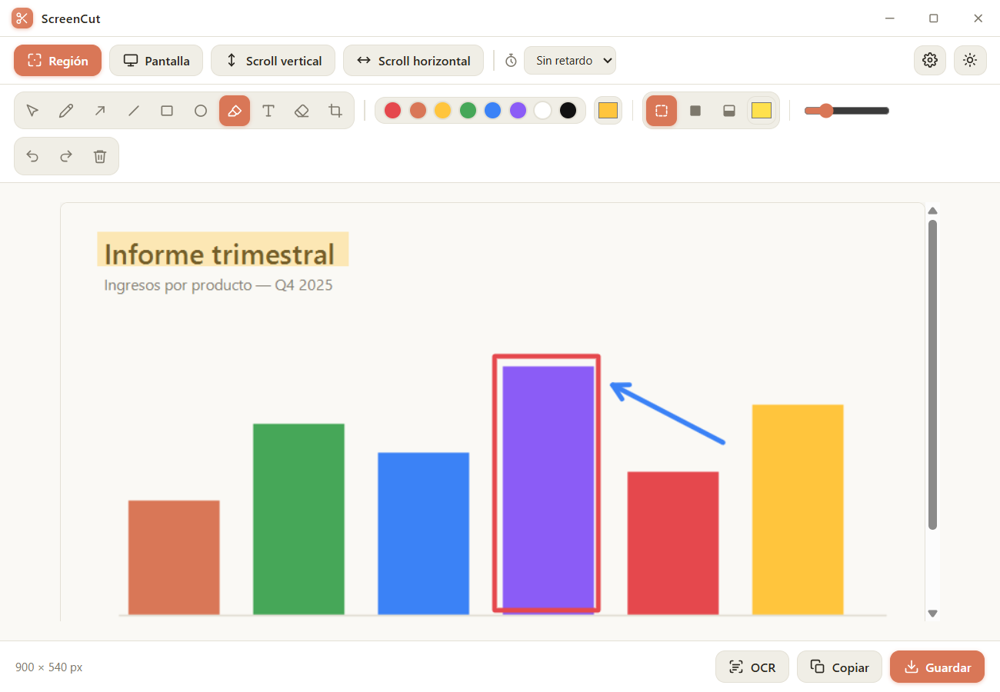
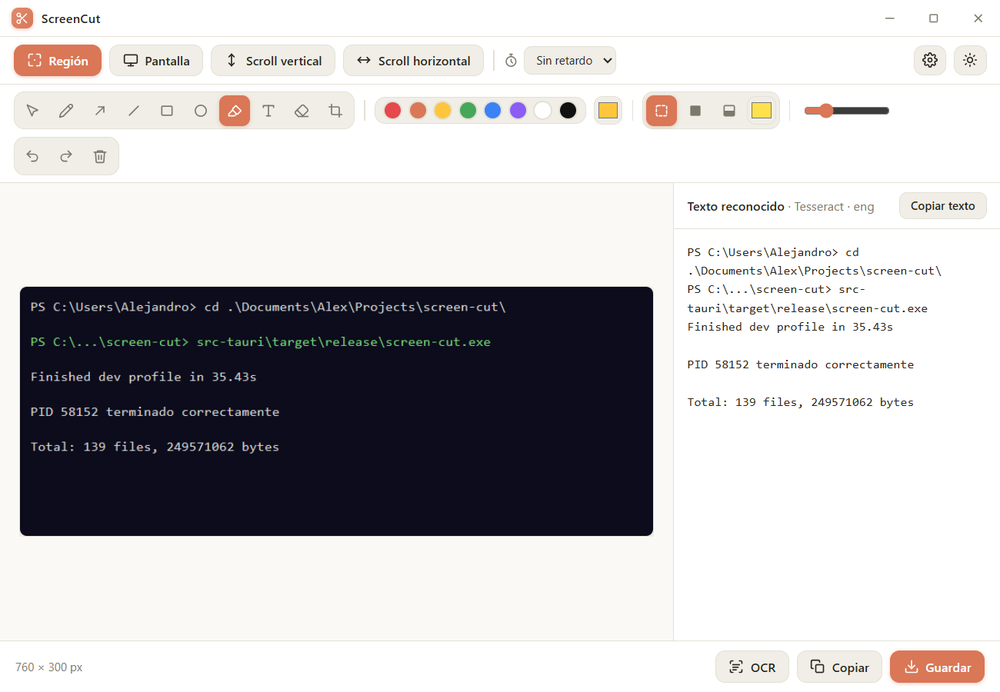
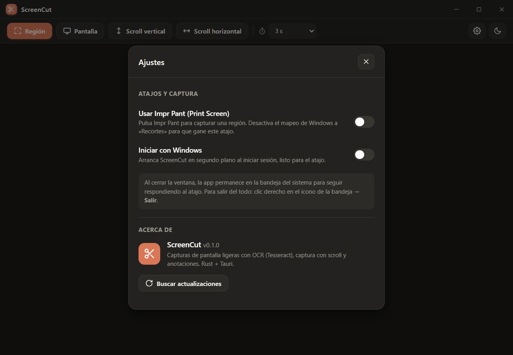

<div align="center">

# ✂️ ScreenCut

### A tiny, fast screenshot tool for Windows — with OCR, scrolling capture and annotations

[](https://github.com/AlexPJ/screen-cut/releases/latest)
[](https://github.com/AlexPJ/screen-cut/releases)
[](LICENSE)
[](#)
[](#)

**[⬇️ Download the latest version](https://github.com/AlexPJ/screen-cut/releases/latest)**



</div>

---

ScreenCut does what the Windows Snipping Tool does, but **faster and with superpowers**: accurate text recognition (OCR), scrolling captures that stitch whole pages into one image, and a full annotation editor. The installer is **1.7 MB** — roughly **50× smaller** than a comparable Electron app — because it uses the WebView2 runtime Windows already ships instead of bundling a whole browser.

## ✨ Features

- 🖼️ **Region, window or full-screen capture** — an overlay freezes the desktop, then you drag to select. Multi-monitor and DPI-scaling aware.
- 📜 **Scrolling capture (Snagit-style)** — vertical and horizontal. Walks through long pages or conversations and stitches them into a single image, detecting the offset pixel by pixel. You decide when to stop.
- 🔤 **Accurate OCR with Tesseract** — pulls text out of any capture, including dark-background terminals (automatic inversion and contrast pre-processing). Copy the text with one click.
- 🎨 **Annotation editor** — arrows, lines, rectangles, ellipses, text, highlighter and freehand drawing. Pick colour and thickness, fill (none / stroke colour / custom colour), move and resize, eraser, **undo/redo** and **cropping**.
- 🔍 **Zoom and fit** — the image fits the window by default; zoom in/out from the bottom bar.
- ⏱️ **Configurable timer** (3 s by default) with an on-screen countdown.
- ⌨️ **Global shortcut** — `Ctrl+Shift+X`, or turn **Print Screen** into your default capture key.
- 🔔 **Lives in the system tray** — always ready, with an optional start-with-Windows setting.
- 🌗 **Light/dark theme**, remembered between sessions.
- 🔄 **Signed automatic updates** built into the app.
- 💾 **Every capture is copied to the clipboard and saved to disk automatically** — no extra click. The destination folder defaults to your OS Pictures folder (`Pictures\Screenshots` on Windows) and is configurable in Settings. You can still **copy** or **save as PNG** the edited/annotated version manually from the bottom bar.

## 📸 Screenshots

**OCR — reads even dark terminals, with paths and symbols intact:**



**Settings and updates (dark theme):**



## 📊 Benchmarks

Measured on an Intel Core i7-10750H (6C/12T), 16 GB RAM, Windows 11 Pro 26200, across a 3840×1080 virtual desktop. Median of 5 runs.

### Size

| Artifact | Size |
| --- | --- |
| **Installer** (NSIS `-setup.exe`) | **1.73 MB** |
| Standalone executable | 4.42 MB |
| Bundled frontend (HTML/CSS/JS) | 73 KB |

No Node, no bundler, no packaged browser — the UI is plain static files embedded in the binary.

### Speed

| Operation | Time |
| --- | --- |
| Cold start (first launch) | ~375 ms |
| Warm start (window on screen) | **~49 ms** |
| Full-screen capture, 3840×1080, end to end | ~630 ms *(400 ms of which is the deliberate window-hide delay; the capture and PNG encode take ~230 ms)* |
| OCR on a 760×300 terminal capture | ~355 ms |
| OCR on a 3840×1080 capture | ~1.6 s |
| Flatten + copy 3840×1080 to clipboard | ~139 ms |

### Memory

The app runs as one native process plus the WebView2 processes Windows spawns for the UI (7 in total). Working-set figures count shared Chromium pages that the OS shares with every other WebView2 app, so **private memory** is the honest number:

| State | Private | Working set |
| --- | --- | --- |
| Idle | ~152 MB | ~347 MB |
| With a 3840×1080 capture loaded | ~239 MB | ~485 MB |
| *Native Rust process alone (idle)* | *~6 MB* | *~28 MB* |

The Rust side is tiny; the footprint is essentially the WebView2 runtime, which is shared with every other WebView2 app on the system. The big win over Electron is the **download size** and the fact that no browser is bundled or updated separately — not a lower RAM ceiling, since the UI still runs on Chromium.

## ⬇️ Download and install

1. Go to the **[releases page](https://github.com/AlexPJ/screen-cut/releases/latest)**.
2. Download `ScreenCut_x.y.z_x64-setup.exe`.
3. Run it. Windows SmartScreen may warn about an unknown publisher: *More info → Run anyway*.

> Requirements: Windows 10/11 (x64). WebView2 ships with Windows 11 and with most up-to-date Windows 10 installs.

Once installed, the app updates itself: **Settings → About → Check for updates**.

## 🚀 Quick start

| Action | How |
| --- | --- |
| Capture a region | **Region** button or `Ctrl+Shift+X` (or Print Screen, if enabled) |
| Full screen | **Screen** button |
| Scrolling capture | **Vertical/Horizontal scroll** → select the area → **Finish** when you're done |
| Extract text (OCR) | **OCR** button |
| Annotate | Top toolbar (arrow, rectangle, text…) |
| Crop | The **crop** ⌏ tool |
| Save / copy | **Save** (PNG) or **Copy** (clipboard) |

## ⌨️ Make it your default screenshot tool

- In **Settings**, enable **"Use Print Screen"**: it registers Print Screen as a global shortcut for region capture and turns off the Windows mapping to the Snipping Tool so this shortcut wins.
- **"Start with Windows"** launches the app in the background at sign-in.
- **Closing** the window hides it in the **system tray**, so the shortcut keeps working. To quit completely: right-click the tray icon → **Quit**.
- **Settings → Guardado** lets you pick where captures are auto-saved (defaults to your OS Pictures folder).

## 🛠️ Build from source

Requirements: [Rust](https://rustup.rs) (rustup), VS Build Tools with C++, and [Tesseract](https://github.com/UB-Mannheim/tesseract/wiki) for OCR.

```powershell
git clone https://github.com/AlexPJ/screen-cut.git
cd screen-cut/src-tauri
cargo build --release              # exe at target/release/screen-cut.exe
# NSIS installer:
cargo install tauri-cli --locked
cargo tauri build
```

The release profile is tuned for size and memory (`opt-level="z"`, LTO, `strip`, `panic=abort`).

### Architecture (clean, modular)

```
src-tauri/src/
  core/     Domain types (RawImage, OcrResult…) — no platform dependencies
  infra/    Windows adapters: capture (GDI), ocr (Tesseract + pre-processing),
            scroll (SendInput + stitching), clipboard (Win32), png_io
  app/      State and Tauri commands (orchestration)
ui/         Static frontend (no Node, no bundler): layered HTML/CSS/JS
```

## 🔤 OCR

Uses **Tesseract** (LSTM engine) invoked as an external process, with image pre-processing (greyscale, automatic inversion on dark backgrounds, contrast stretch, 2× upscale). If Tesseract isn't present it falls back to the native Windows engine. It looks for `tesseract.exe` next to the executable, on the `PATH`, or in the standard install locations. To ship it self-contained, include the Tesseract folder (with `tessdata`) next to the `.exe`.

## 🔄 Publishing a new version (maintainers)

<details>
<summary>Release flow and updater signing</summary>

1. Bump the version in `src-tauri/tauri.conf.json` and `Cargo.toml`.
2. Build **with signing** (private key `src-tauri/screencut.key`, never committed):
   ```powershell
   $env:TAURI_SIGNING_PRIVATE_KEY = Get-Content src-tauri\screencut.key -Raw
   $env:TAURI_SIGNING_PRIVATE_KEY_PASSWORD = ""
   cargo tauri build
   ```
   This produces `*-setup.exe` and its signature `*-setup.exe.sig` in `src-tauri/target/release/bundle/nsis/`.
3. Create a **GitHub Release** (tag `vX.Y.Z`) and upload the `*-setup.exe` plus a `latest.json`:
   ```json
   {
     "version": "0.2.0",
     "notes": "What's new…",
     "pub_date": "2026-01-01T00:00:00Z",
     "platforms": {
       "windows-x86_64": {
         "signature": "<full contents of *-setup.exe.sig>",
         "url": "https://github.com/AlexPJ/screen-cut/releases/download/v0.2.0/ScreenCut_0.2.0_x64-setup.exe"
       }
     }
   }
   ```

The installed app compares its version against `latest.json` (served from `.../releases/latest/download/latest.json`) and offers to update.

</details>

## 📄 License

[MIT](LICENSE) © Alejandro Padilla

<div align="center">
<sub>Built with Rust + Tauri. Small by design.</sub>
</div>
