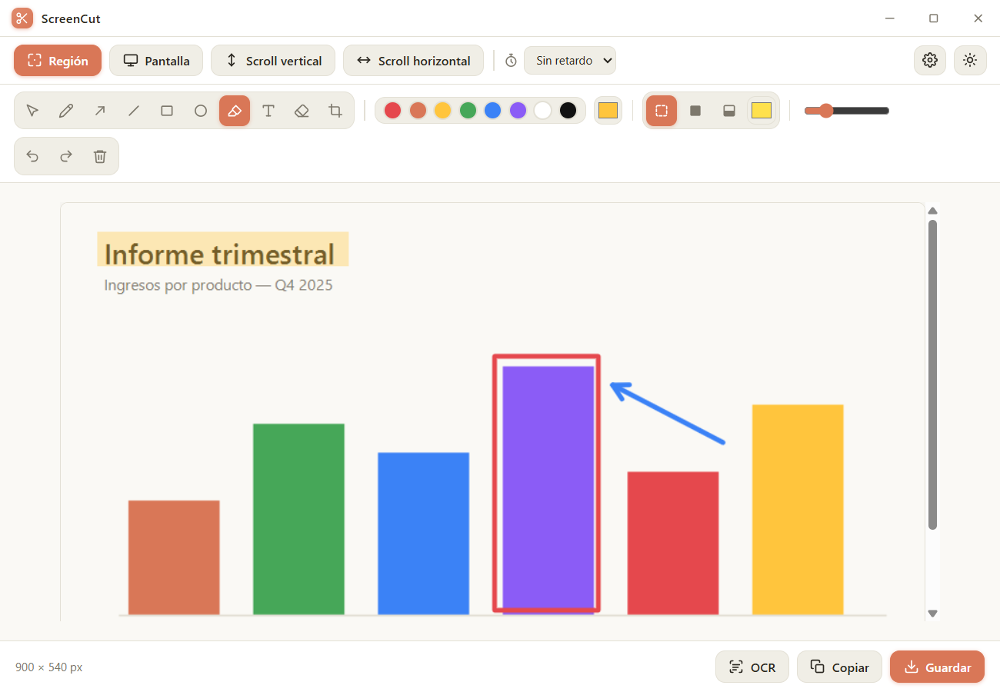
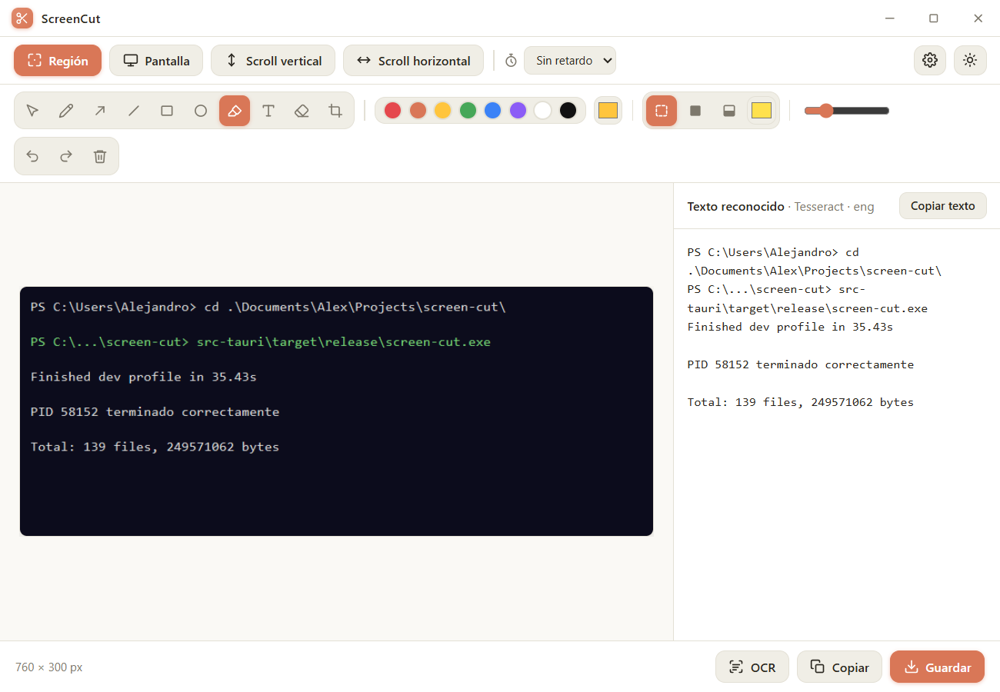
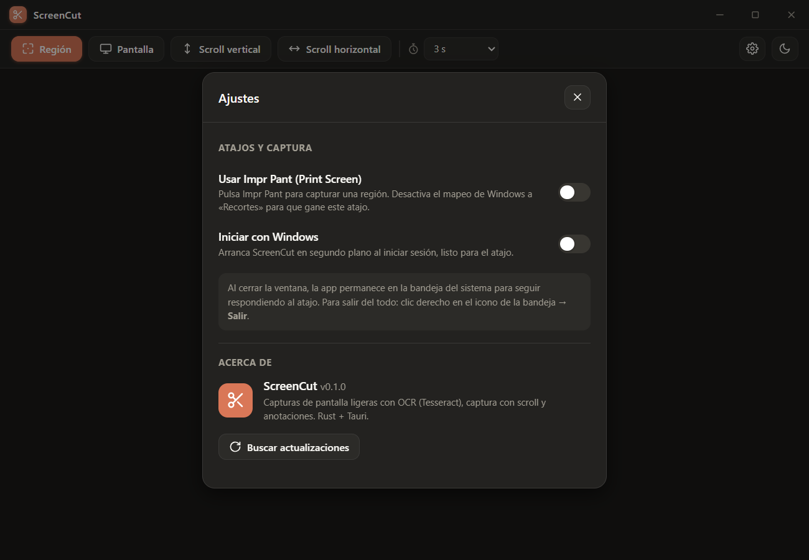

<div align="center">

# ✂️ ScreenCut

### A tiny, fast screenshot tool for Windows, macOS and Linux — with OCR, scrolling capture and annotations

[](https://github.com/AlexPJ/screen-cut/releases/latest)
[](https://github.com/AlexPJ/screen-cut/releases)
[](LICENSE)
[](#)
[](#)
[](#)
[](#)

**[⬇️ Download the latest version](https://github.com/AlexPJ/screen-cut/releases/latest)**



</div>

---

ScreenCut does what the Windows Snipping Tool does, but **faster and with superpowers**: accurate text recognition (OCR), scrolling captures that stitch whole pages into one image, and a full annotation editor. The Windows installer is **1.7 MB** — roughly **50× smaller** than a comparable Electron app — because it uses the web view the OS already ships (WebView2 on Windows, WKWebView on macOS, WebKitGTK on Linux) instead of bundling a whole browser.

## ✨ Features

- 🖼️ **Region, window or full-screen capture** — an overlay freezes the desktop, then you drag to select. Multi-monitor and DPI-scaling aware.
- 📜 **Scrolling capture (Snagit-style)** — vertical and horizontal. Walks through long pages or conversations and stitches them into a single image, detecting the offset pixel by pixel. You decide when to stop.
- 🔤 **Accurate OCR with Tesseract** — pulls text out of any capture, including dark-background terminals (automatic inversion and contrast pre-processing). Copy the text with one click. On macOS it works out of the box with Apple's Vision framework when Tesseract isn't installed.
- 🎨 **Annotation editor** — arrows, lines, rectangles, ellipses, text, highlighter and freehand drawing. Pick colour and thickness, fill (none / stroke colour / custom colour), move and resize, eraser, **undo/redo** and **cropping**.
- 🔍 **Zoom and fit** — the image fits the window by default; zoom in/out from the bottom bar.
- ⏱️ **Configurable timer** (3 s by default) with an on-screen countdown.
- ⌨️ **Global shortcut** — `Ctrl+Shift+X` (`⌃⇧X` on macOS), or turn **Print Screen** into your default capture key (Windows and Linux).
- 🔔 **Lives in the system tray / menu bar** — always ready, with an optional launch-at-login setting.
- 🌗 **Light/dark theme**, remembered between sessions.
- 🔄 **Signed automatic updates** built into the app.
- 💾 **Every capture is copied to the clipboard and saved to disk automatically** — no extra click. The destination folder defaults to `Screenshots` inside your OS Pictures folder and is configurable in Settings. You can still **copy** or **save as PNG** the edited/annotated version manually from the bottom bar.

## 📸 Screenshots

**OCR — reads even dark terminals, with paths and symbols intact:**



**Settings and updates (dark theme):**



## 📊 Benchmarks

Windows figures, measured on an Intel Core i7-10750H (6C/12T), 16 GB RAM, Windows 11 Pro 26200, across a 3840×1080 virtual desktop. Median of 5 runs.

### Size

| Artifact | Size |
| --- | --- |
| **Installer** (NSIS `-setup.exe`) | **1.73 MB** |
| Standalone executable | 4.42 MB |
| Bundled frontend (HTML/CSS/JS) | 73 KB |

No Node, no bundler, no packaged browser — the UI is plain static files embedded in the binary.

### Speed

| Operation | Time |
| --- | --- |
| Cold start (first launch) | ~375 ms |
| Warm start (window on screen) | **~49 ms** |
| Full-screen capture, 3840×1080, end to end | ~630 ms *(400 ms of which is the deliberate window-hide delay; the capture and PNG encode take ~230 ms)* |
| OCR on a 760×300 terminal capture | ~355 ms |
| OCR on a 3840×1080 capture | ~1.6 s |
| Flatten + copy 3840×1080 to clipboard | ~139 ms |

### Memory

The app runs as one native process plus the WebView2 processes Windows spawns for the UI (7 in total). Working-set figures count shared Chromium pages that the OS shares with every other WebView2 app, so **private memory** is the honest number:

| State | Private | Working set |
| --- | --- | --- |
| Idle | ~152 MB | ~347 MB |
| With a 3840×1080 capture loaded | ~239 MB | ~485 MB |
| *Native Rust process alone (idle)* | *~6 MB* | *~28 MB* |

The Rust side is tiny; the footprint is essentially the WebView2 runtime, which is shared with every other WebView2 app on the system. The big win over Electron is the **download size** and the fact that no browser is bundled or updated separately — not a lower RAM ceiling, since the UI still runs on Chromium.

## ⬇️ Download and install

Everything is on the **[releases page](https://github.com/AlexPJ/screen-cut/releases/latest)**.

### Windows

1. Download `ScreenCut_x.y.z_x64-setup.exe` and run it.
2. Windows SmartScreen may warn about an unknown publisher: *More info → Run anyway*.

> Requirements: Windows 10/11 (x64). WebView2 ships with Windows 11 and with most up-to-date Windows 10 installs.

### macOS

1. Download `ScreenCut_x.y.z_universal.dmg` (one build for Apple Silicon and Intel), open it and drag **ScreenCut** to **Applications**.
2. The app is not notarised by Apple, so the first launch is blocked. Go to **System Settings → Privacy & Security**, scroll down and click **Open Anyway**.
3. On the first capture macOS asks for **Screen & System Audio Recording** permission. Grant it and reopen the app. Scrolling capture also needs **Accessibility** permission, because it simulates the mouse wheel.

> Requirements: macOS 11 Big Sur or later. Because the app is not signed with a Developer ID, macOS may ask for these permissions again after an update.

### Linux

| Distro | File | Install |
| --- | --- | --- |
| Debian, Ubuntu, Mint… | `ScreenCut_x.y.z_amd64.deb` | `sudo apt install ./ScreenCut_x.y.z_amd64.deb` |
| Fedora, openSUSE… | `ScreenCut-x.y.z-1.x86_64.rpm` | `sudo dnf install ./ScreenCut-x.y.z-1.x86_64.rpm` |
| Any | `ScreenCut_x.y.z_amd64.AppImage` | `chmod +x` it and run it |

The `.deb` and `.rpm` pull in Tesseract for OCR. With the AppImage, install it yourself (`sudo apt install tesseract-ocr tesseract-ocr-spa`).

> Works best on an **X11** session. On **Wayland**, screenshots go through the desktop portal, but the global shortcut, the region overlay placement and scrolling capture are limited by what the compositor allows other apps to do.

Once installed, the app updates itself: **Settings → About → Check for updates**. On Linux this only works for the AppImage; update the `.deb`/`.rpm` by installing the new file.

## 🚀 Quick start

| Action | How |
| --- | --- |
| Capture a region | **Region** button or `Ctrl+Shift+X` (or Print Screen, if enabled) |
| Full screen | **Screen** button |
| Scrolling capture | **Vertical/Horizontal scroll** → select the area → **Finish** when you're done |
| Extract text (OCR) | **OCR** button |
| Annotate | Top toolbar (arrow, rectangle, text…) |
| Crop | The **crop** ⌏ tool |
| Save / copy | **Save** (PNG) or **Copy** (clipboard) |

## ⌨️ Make it your default screenshot tool

- In **Settings**, enable **"Use Print Screen"** (Windows and Linux): it registers Print Screen as a global shortcut for region capture. On Windows it also turns off the mapping to the Snipping Tool so this shortcut wins; on Linux, turn off your desktop's own Print Screen binding.
- **"Start with Windows"** / **"Open at login"** launches the app in the background at sign-in.
- **Closing** the window hides it in the **system tray** (the **menu bar** on macOS), so the shortcut keeps working. To quit completely: tray icon → **Quit**.
- **Settings → Guardado** lets you pick where captures are auto-saved (defaults to your OS Pictures folder).

## 🛠️ Build from source

Common requirement: [Rust](https://rustup.rs) (rustup). No Node or bundler is needed.

| Platform | Also install |
| --- | --- |
| Windows | VS Build Tools with C++, and [Tesseract](https://github.com/UB-Mannheim/tesseract/wiki) for OCR |
| macOS | Xcode Command Line Tools (`xcode-select --install`). Tesseract is optional (`brew install tesseract tesseract-lang`) |
| Linux | The system libraries listed in [`.github/scripts/linux-deps.sh`](.github/scripts/linux-deps.sh) (Ubuntu/Debian names), plus `tesseract-ocr` |

```bash
git clone https://github.com/AlexPJ/screen-cut.git
cd screen-cut/src-tauri
cargo build --release              # binary in target/release/
# Installers (NSIS on Windows, .app/.dmg on macOS, .deb/.rpm/.AppImage on Linux):
cargo install tauri-cli --locked
cargo tauri build
# macOS, one binary for Apple Silicon and Intel:
rustup target add aarch64-apple-darwin x86_64-apple-darwin
cargo tauri build --target universal-apple-darwin
```

A local `cargo tauri build` also signs the updater artifacts, so it needs the signing key (see *Building a release locally* below). Without it, pass `-c '{"bundle":{"createUpdaterArtifacts":false}}'`.

The release profile is tuned for size and memory (`opt-level="z"`, LTO, `strip`, `panic=abort`).

### Architecture (clean, modular)

```
src-tauri/src/
  core/     Domain types (RawImage, OcrResult…) — no platform dependencies
  infra/    Platform adapters:
            capture   GDI on Windows, xcap on macOS/Linux
            input     mouse wheel for scrolling capture (SendInput, CGEvent, XTEST)
            clipboard Win32 on Windows, arboard on macOS/Linux
            ocr       Tesseract + pre-processing; Windows.Media.Ocr / Vision fallback
            scroll    frame stitching, png_io, macos (Vision, NSWindow tweaks)
  app/      State and Tauri commands (orchestration)
ui/         Static frontend (no Node, no bundler): layered HTML/CSS/JS
```

## 🔤 OCR

Uses **Tesseract** (LSTM engine) invoked as an external process, with image pre-processing (greyscale, automatic inversion on dark backgrounds, contrast stretch, 2× upscale). It looks for `tesseract` next to the executable, on the `PATH`, or in the standard install locations (including Homebrew's `/opt/homebrew/bin` and `/usr/local/bin`, since macOS apps don't inherit your shell's `PATH`).

If Tesseract isn't present it falls back to the OS engine: `Windows.Media.Ocr` on Windows and **Vision** on macOS. Linux has no built-in engine, so OCR there needs Tesseract. To ship it self-contained on Windows, include the Tesseract folder (with `tessdata`) next to the `.exe`.

## 🔄 Publishing a new version (maintainers)

Releases are built and signed by GitHub Actions.

1. Bump the version in `src-tauri/tauri.conf.json` **and** `src-tauri/Cargo.toml`.
2. Commit, then tag and push:
   ```powershell
   git tag v0.2.0
   git push origin v0.2.0
   ```
3. The **Release** workflow builds on Windows, macOS and Linux runners, signs the updater artifacts and publishes one GitHub release with every installer, their `.sig` files and a `latest.json` covering all platforms.

Pull requests run the **Build** workflow, which builds the same installers without publishing and keeps them as workflow artifacts.

The installed app compares its version against `latest.json` (served from `.../releases/latest/download/latest.json`) and offers to update.

<details>
<summary>One-time setup: updater signing secrets</summary>

The signing keypair lives in `src-tauri/screencut.key` (private, git-ignored) and `src-tauri/screencut.key.pub` (public, pasted into `tauri.conf.json` as `plugins.updater.pubkey`).

Add one repository secret under **Settings → Secrets and variables → Actions**:

| Secret | Value |
| --- | --- |
| `TAURI_SIGNING_PRIVATE_KEY` | the full contents of `src-tauri/screencut.key` |

The key has no password, and the workflow passes an empty one as a literal. Do not move that into a secret: GitHub does not reliably export an empty secret into the job, and the signer then fails with *"Wrong password for that key"* after an otherwise successful build.

To copy the private key to the clipboard:

```powershell
Get-Content src-tauri\screencut.key -Raw | Set-Clipboard
```

Keep a backup of that file somewhere safe. Lose it and existing installs can no longer verify updates.

</details>

<details>
<summary>Building a release locally instead</summary>

```powershell
$env:TAURI_SIGNING_PRIVATE_KEY = Get-Content src-tauri\screencut.key -Raw
$env:TAURI_SIGNING_PRIVATE_KEY_PASSWORD = ""
cargo tauri build
```

On macOS or Linux:

```bash
export TAURI_SIGNING_PRIVATE_KEY="$(cat src-tauri/screencut.key)"
export TAURI_SIGNING_PRIVATE_KEY_PASSWORD=""
cargo tauri build
```

The installers and their signatures land in `src-tauri/target/release/bundle/` (under `target/universal-apple-darwin/` for a universal macOS build).

</details>

## 📄 License

[MIT](LICENSE) © Alejandro Padilla

<div align="center">
<sub>Built with Rust + Tauri. Small by design.</sub>
</div>
